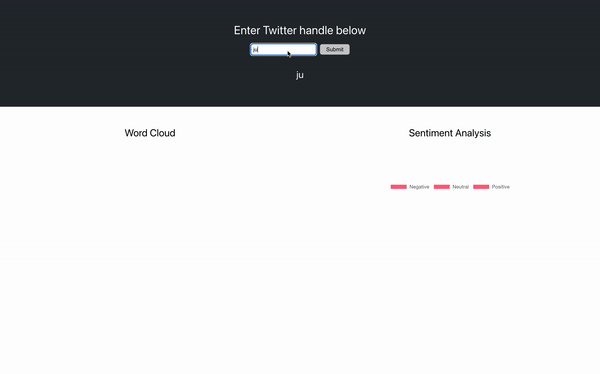

# twitter-word-cloud
Generates word cloud of tweets

## Summary


# Installation:
Requires yarn package manager to be installed

1. Clone the project
    ```python3
    git clone https://github.com/mel-liow/twitter-analysis.git
    ```
2. Create a virtualenv in `/server` directory
    ```python3
    python3 -m venv venv
    ```
3. Activate the virtualenv
    ```python3
    source venv/bin/activate
    ```
4. Now install all the dependencies in requirements.txt using the following command :
    ```python3
    pip intsall -r requirements.txt
    ```
5. Create `config.py` in `/server` directory and fill in the following with your Twitter API key and secret:
    ```python3
    TWITTER_KEY=""
    TWITTER_SECRET=""
    ```

6. NLTK data needs to be downloaded in order to load stopwords and wordnet. More information on how to download the data can be found at [NLTK.org](https://www.nltk.org/data.html). 
# Running the project locally:
This command will run a temprorary local flask server on port 5000:
```python
cd server && flask run
```

To run the frontend React app on port 3000, open a new terminal and run the following:
```python
yarn start
```
